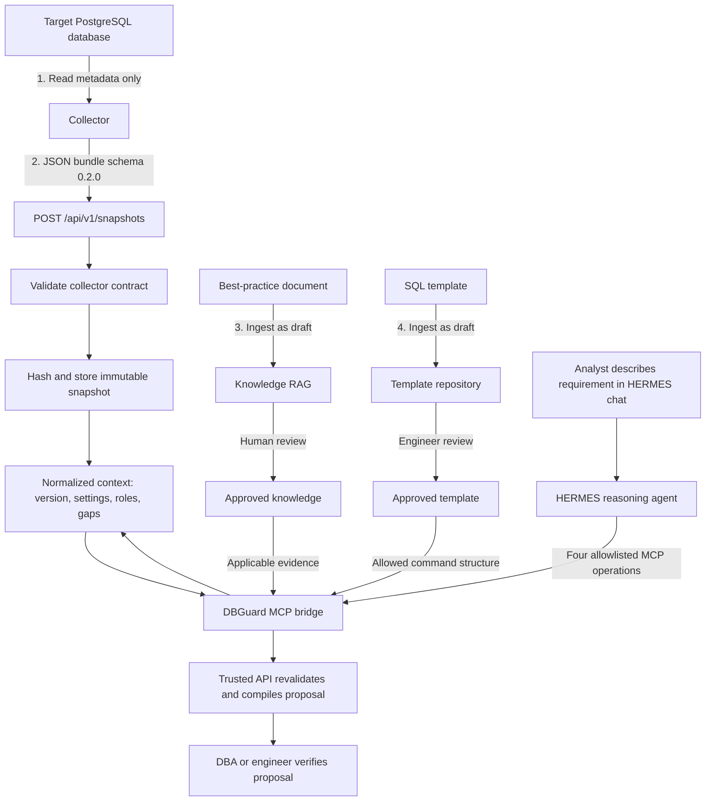
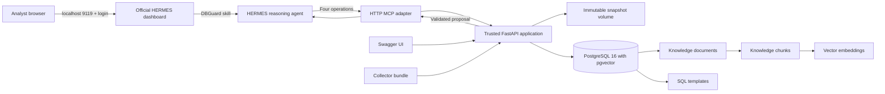
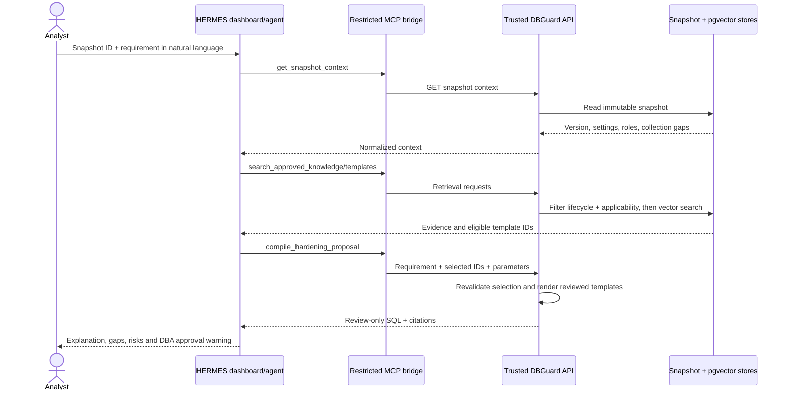
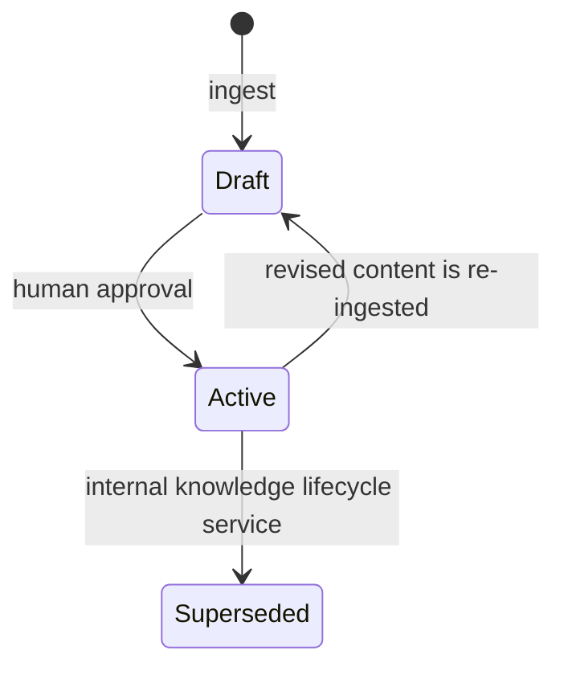
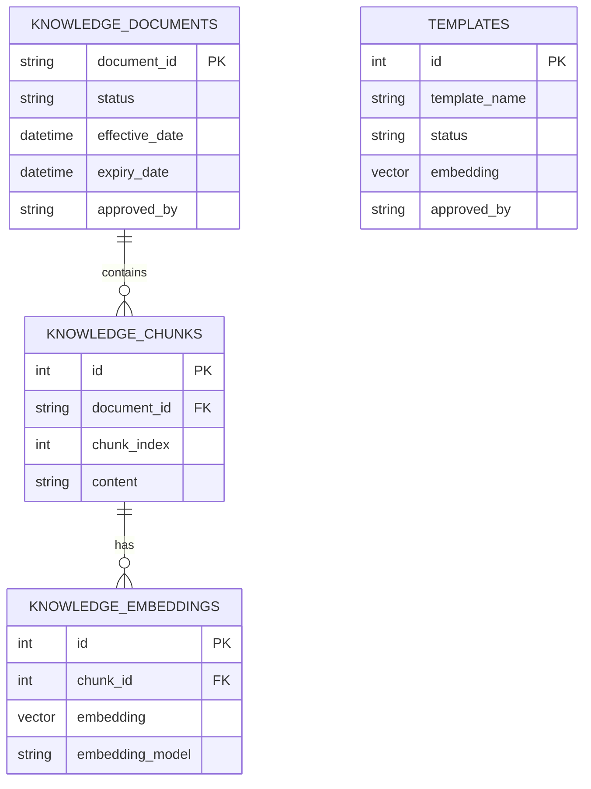

# DBGuardAI architecture

## What the application does

DBGuardAI helps a database analyst turn a PostgreSQL hardening requirement
written in ordinary language into a reviewable SQL proposal. The analyst does
not need to remember every PostgreSQL setting or command. The application uses:

- a read-only snapshot of the target database configuration;
- approved PostgreSQL best-practice documents;
- SQL templates that an engineer has reviewed;
- AI to match the requirement to the evidence and fill the approved template.

The generated SQL is never executed automatically. A DBA or engineer remains
responsible for checking its accuracy, operational impact, and compatibility.

## Current application flow

## Running components

The default Docker Compose deployment starts:

- `api`: snapshot intake, knowledge management, template management, semantic
  retrieval, and proposal generation;
- `postgres`: PostgreSQL with pgvector for knowledge and template storage;
- `mcp`: a stateless HTTP adapter that exposes only the four operations HERMES
  needs and does not expose ingestion, approval, database or execution access;
- `hermes`: the official v0.21.0 runtime pinned by image digest, DBGuard context
  and skill, authenticated dashboard, gateway API, and persistent sessions.

Twin runner, assessment, and reporting are deferred and are not started by the
current Compose file.

## API endpoints in simple terms

### Service status

#### `GET /api/v1/health`

Answers: “Is DBGuardAI running?”

It returns the service status and makes the current scope explicit. Assessment
and twin execution are reported as disabled, so the UI cannot imply that a
proposal has been tested or applied.

### Collector snapshots

#### `POST /api/v1/snapshots`

Uploads the JSON file produced by the read-only collector.

DBGuardAI:

1. checks that it follows collector schema `0.2.0`;
2. preserves all sections and collection gaps;
3. creates a SHA-256 content hash;
4. stores it atomically under a stable `snapshot_id`.

Uploading the same content again returns the same ID rather than creating a
different copy.

#### `GET /api/v1/snapshots/{snapshot_id}`

Returns the safe database context used during proposal generation, including:

- database and target names;
- PostgreSQL major version;
- collected settings and roles;
- available sections;
- sections the collector could not read.

An empty list means the collector checked the section and found nothing. A
`null` value with a matching gap means the collector could not check it. These
states must never be treated as equivalent.

### SQL templates

#### `POST /api/v1/templates/ingest-all`

Loads every bundled `.sql.j2` template into pgvector. Templates are saved as
drafts so that loading files does not automatically approve them for AI use.

#### `POST /api/v1/templates/ingest`

Adds or updates one SQL template and its description, tags, risk level, and
supported PostgreSQL version. A new template is a draft unless a named reviewer
explicitly submits it as active.

#### `GET /api/v1/templates/search`

Searches only active, human-approved templates using semantic similarity. For
example, “create an auditor who cannot change data” can retrieve the reviewed
read-only-role template.

#### `POST /api/v1/templates/{template_name}/approve`

Records that an engineer reviewed a draft template. The endpoint stores the
reviewer and activation time. Only then can the proposal engine retrieve it.

### PostgreSQL best-practice knowledge

#### `POST /api/v1/knowledge/documents`

Adds a guidance document to the RAG knowledge base. DBGuardAI divides the text
into traceable sections, generates an embedding for each chunk, and stores:

- source title, URL, and version;
- applicable PostgreSQL versions;
- applicable environments such as `prod`, `dev`, or `all`;
- effective and expiry dates;
- classification and policy owner.

Documents are drafts by default.

#### `POST /api/v1/knowledge/documents/{document_id}/approve`

Records human approval and changes a draft document to active. HERMES is not
allowed to call this lifecycle-changing operation.

#### `GET /api/v1/knowledge/documents/{document_id}`

Shows the document’s metadata and lifecycle without returning every embedded
chunk. It is useful for confirming its version, source, applicability, status,
reviewer, and approval time.

#### `GET /api/v1/knowledge/search`

Searches guidance by meaning rather than exact wording. Results are returned
only when the parent document is:

- active and human-approved;
- already effective;
- not expired;
- applicable to the requested PostgreSQL version;
- applicable to the requested environment.

Each result includes its source document, version, section, URL, and similarity
score so the engineer can verify the recommendation.

### Proposal generation

#### `POST /api/v1/harden`

This is the legacy direct-AI application endpoint. It accepts:

- `user_prompt`: the analyst’s natural-language hardening requirement;
- `snapshot_id`: the stored collector snapshot to use as database context;
- `environment`: where the database operates, such as `prod` or `dev`.

DBGuardAI then:

1. reads the normalized snapshot context;
2. retrieves applicable approved guidance;
3. retrieves relevant approved SQL templates;
4. asks the AI to select only from those retrieved templates;
5. validates that the AI did not invent a template ID;
6. safely fills PostgreSQL identifiers in the chosen template;
7. returns SQL, reasoning, citations, and a mandatory DBA-approval flag.

If no approved evidence or template is available, the endpoint returns
`MANUAL_REVIEW_REQUIRED` instead of inventing a command.

#### `POST /api/v1/proposals/compile`

This is the trusted compilation endpoint used by HERMES. It accepts the
snapshot ID, natural-language requirement, environment, template IDs selected
by HERMES, and the template parameters.

It deliberately performs no second LLM call. Instead, the API:

1. reloads the immutable snapshot;
2. reruns active template retrieval inside the trusted boundary;
3. rejects any selected ID outside that result set;
4. searches for approved, effective and applicable RAG evidence;
5. safely quotes identifiers and renders only stored reviewed templates;
6. returns the SQL, citations, selection explanation and mandatory DBA review
   flag.

This separation lets HERMES understand conversational intent while preventing
the agent from inventing or directly emitting executable SQL.

## HERMES and MCP boundary

The MCP server exposes exactly these four tools:

- `get_snapshot_context`;
- `search_approved_knowledge`;
- `search_approved_templates`;
- `compile_hardening_proposal`.

It exposes zero MCP prompts and zero MCP resources. HERMES may represent these
behind its deferred `tool_search`, `tool_describe` and `tool_call` facade, but
the underlying registry remains limited to the same four operations.

## Approval lifecycle

Knowledge and SQL templates use the same simple control:

Re-ingesting content returns it to draft so changed material must be reviewed
again. The current public API exposes draft ingestion and human approval.
Superseding a knowledge version exists in the internal RAG service but does not
yet have a public endpoint. HERMES can search active material but cannot approve
or change lifecycle state.

## Knowledge-table relationships

`knowledge_documents` owns the lifecycle. Search joins every matching chunk back
to its parent document, preventing chunks from expired, draft, archived, or
superseded documents from appearing in results.

## Security boundaries

- The collector reads configuration metadata, not application rows.
- Collector gaps are surfaced as unknown evidence rather than false passes.
- Snapshots are content-addressed and written atomically.
- RAG text is treated as untrusted evidence and cannot override agent rules.
- Only active, approved evidence and templates are retrieved.
- SQL identifiers are quoted before template rendering.
- Passwords are deliberately excluded from generated role scripts.
- The AI cannot introduce a template outside the approved retrieval set.
- HERMES cannot access PostgreSQL, execute SQL, use Docker, approve content, or
  approve its own proposal.
- HERMES browser, web, shell, file, process, code-execution, memory, delegation,
  and scheduled-job toolsets are disabled for the API/dashboard agent.
- The dashboard is password protected, its password is hashed at startup, and
  host-facing HERMES ports bind only to loopback.
- The HERMES persistent volume stores conversations and runtime state; managed
  DBGuard instructions and the `dbguard-hardening` skill are refreshed from the
  image at every start.

## Deferred architecture

The source for twin-runner and reporting is retained for future work. Before
those components are enabled, the project still needs:

- a baseline assessment and scoring contract;
- a narrow twin-runner HTTP boundary;
- real signed and approved PostgreSQL image records;
- isolation and compatibility integration tests;
- a proposal approval and review-package workflow;
- production authentication, authorization, audit logging, and secret storage.
