# DBGuardAI

DBGuardAI lets a database analyst describe a PostgreSQL hardening requirement
in ordinary language and receive an evidence-backed SQL proposal for an
engineer to verify. It lowers the knowledge and coding barrier without giving
AI permission to connect to the target database or execute a command.

## Current implemented scope

A standalone [local sandbox POC](services/sandbox_poc/README.md) implements
the first spec-driven milestone: PostgreSQL 17 `log_connections`, a bounded
LangGraph test loop, full supplied-spec reassessment, source-aware rollback and
verified cleanup. It uses disposable databases and does not require the Compose
stack for its demo. Run `python scripts/sandbox_poc.py demo --output data/sandbox-demo.json`
after the dependency/image setup in that guide.

The new `POST /api/v1/sandbox/runs` accepts a [pinned upstream handoff](services/sandbox_poc/API.md)
and reads approved templates/evidence from the registry before testing. It is
disabled by default and can run through a standalone API on the local Docker host.

The existing HTTP sandbox endpoint and the following diagram describe the legacy
path. That path has not been migrated to this loop and must not be treated as
proof of exact rollback or regression verification.

```mermaid
flowchart LR
    A[Target PostgreSQL] -->|read-only metadata| B[Collector]
    B -->|JSON bundle 0.2.0| C[DBGuard snapshot API]
    U[Analyst in HERMES dashboard] -->|natural-language requirement| H[HERMES agent]
    H -->|four allowed tools only| M[DBGuard MCP bridge]
    M --> C
    C --> S[Normalized snapshot]
    C --> R[(Approved guidance + SQL templates in pgvector)]
    S --> P[Validated proposal compiler]
    R --> P
    P -->|SQL + citations + risks| H
    H -->|validated proposal + rendered SQL| V[DBGuard API sandbox validate]
    V -->|SandboxValidationService| W[Twin Runner]
    W -->|restricted methods| X[Ephemeral PostgreSQL sandbox]
    X -->|reproduce FAIL| Y[Re-verify via AssessmentService]
    Y -->|apply proposal| Z[Verify PASS]
    Z -->|rollback| AA[Verify original state restored]
    AA --> AB[Destroy sandbox]
    AB -->|structured evidence| H
    H --> AC[DBA or engineer verification]
```



## What runs

`deploy/compose.yaml` starts four containers:

- `postgres`: PostgreSQL 16 with pgvector for knowledge and templates;
- `api`: trusted FastAPI boundary for snapshots, retrieval and proposals;
- `mcp`: a read-only HTTP MCP adapter exposing four DBGuard operations;
- `hermes`: the official HERMES Agent v0.21.0 image, pinned by digest, with
  DBGuard instructions, its built-in ChatGPT-style dashboard, authentication,
  and persistent conversation state.

The existing collector stays separate because it runs near the target database
and sends its output to DBGuardAI. The twin runner and reporting source remain
in the repository for later phases but are not enabled in Compose.

## Quick start

1. Copy `.env.example` to `.env` and change all development passwords and API
   keys.
2. Add an Ollama Cloud API key to `OLLAMA_API_KEY`. HERMES defaults to the
   tool-capable `gpt-oss:20b` cloud model through
   `https://ollama.com/v1`; no local chat-model download is required. The
   Ollama free plan includes a starter amount of monthly usage.
3. Start the complete stack:

   ```sh
   docker compose --env-file .env -f deploy/compose.yaml up --build
   ```

4. Open these local pages:

   - HERMES chat: `http://localhost:9119`
   - DBGuard API documentation: `http://localhost:8000/docs`

5. Sign in to HERMES with `HERMES_DASHBOARD_USERNAME` and
   `HERMES_DASHBOARD_PASSWORD` from `.env`.
6. Upload the collector JSON to `POST /api/v1/snapshots`, then give the
   returned `snapshot_id` to the chat and describe the hardening requirement.

HERMES and both host-facing ports bind to localhost. The dashboard password is
hashed into the runtime configuration at container startup; plaintext is not
baked into the image.

The chat model and RAG embedding model are separate. Ollama Cloud currently
accepts `gpt-oss:20b` chat requests but does not provide the configured
`nomic-embed-text` embedding model. Existing document vectors remain stored,
but ingesting or semantically querying content requires either a local
`nomic-embed-text` service or a separately configured cloud embedding
provider. Never send unredacted database secrets to either provider.

## What the chat can do

HERMES receives the `dbguard-hardening` skill on every dashboard session. Its
MCP allowlist contains only:

| HERMES operation | What it does |
|---|---|
| `get_snapshot_context` | Reads normalized, redacted facts from one uploaded collector snapshot |
| `get_snapshot_assessment` | Evaluates snapshot against control rules, returns pass/fail/gap findings |
| `search_approved_knowledge` | Finds only active, effective and applicable PostgreSQL guidance |
| `search_approved_templates` | Finds only active, human-reviewed SQL templates |
| `validate_and_render_proposal` | Validates proposal and renders review-only SQL from approved templates |

HERMES cannot use this bridge to ingest or approve content, access PostgreSQL,
execute SQL, use the host shell, or operate Docker.

## API endpoints

| Method | Endpoint | Simple purpose |
|---|---|---|
| `GET` | `/api/v1/health` | Check whether the DBGuard API is ready |
| `POST` | `/api/v1/snapshots` | Validate and store collector bundle `0.2.0` |
| `GET` | `/api/v1/snapshots/{snapshot_id}` | Read safe normalized snapshot context |
| `GET` | `/api/v1/snapshots/{snapshot_id}/assessment` | Evaluate snapshot against control rules, return pass/fail/gap findings |
| `POST` | `/api/v1/knowledge/documents` | Ingest a draft or explicitly reviewed source |
| `POST` | `/api/v1/knowledge/documents/{id}/approve` | Record human approval of a draft source |
| `GET` | `/api/v1/knowledge/documents/{id}` | Inspect source provenance and lifecycle |
| `GET` | `/api/v1/knowledge/search` | Search only approved, applicable guidance |
| `POST` | `/api/v1/templates/ingest` | Ingest a draft or reviewed SQL template |
| `POST` | `/api/v1/templates/ingest-all` | Ingest bundled SQL templates |
| `GET` | `/api/v1/templates/search` | Search approved templates by semantic similarity |
| `POST` | `/api/v1/templates/{name}/approve` | Record human approval of an exact template version |
| `POST` | `/api/v1/proposals/validate-and-render` | Validate HERMES's choices and deterministically render approved templates from PostgreSQL |
| `POST` | `/api/v1/sandbox/validate` | Legacy sandbox path; not migrated |
| `POST` | `/api/v1/sandbox/runs` | Test a pinned spec/assessment handoff with approved registry content; local opt-in |

The trusted backend still reruns retrieval, rejects template
IDs outside the active result set, applies safe parameter handling, and
requires approved RAG evidence before returning SQL.

The older `metadata_snapshot` field remains on `/api/v1/proposals/validate-and-render` for client
compatibility, but new integrations should always use `snapshot_id`.

## Evidence and approval rules

- `[]` means the collector checked a section and found no records.
- `null` plus a matching `gaps` entry means it could not collect that section.
- Knowledge is searchable only while its parent document is active, effective,
  unexpired, and applicable to the requested PostgreSQL version/environment.
- Knowledge and SQL templates default to draft and require named human
  approval before retrieval.
- Re-ingesting changed knowledge atomically replaces its chunks and returns the
  document to review where required.
- Every generated command remains a proposal. A qualified engineer must verify
  it before it is applied.

## Repository structure

```text
backend/                       Trusted FastAPI application
collector/                     Existing read-only PostgreSQL evidence collector
db/                            Canonical PostgreSQL + pgvector schema
deploy/                        Four-service Docker Compose stack
hermes/                        Official-image wrapper, config, context and skill
services/dbguard_mcp/          Restricted HTTP MCP-to-API adapter
services/rag/                  Lifecycle-aware knowledge ingestion and retrieval
services/twin_runner/          Deferred twin lifecycle library
services/reporting/            Deferred reporting library
catalog/controls/              Future reviewed baseline controls
catalog/images/examples/       Non-runnable image-record examples
```

See [ARCHITECTURE.md](ARCHITECTURE.md) for the detailed trust boundaries,
endpoint behavior and application flow. See [hermes/README.md](hermes/README.md)
for HERMES packaging, installation and troubleshooting.

## Deferred work

> **Status (Sept 2026)**: These items are part of future phases. Phase 0 (contracts)
> is the current priority. See [pcss.md](../local%20docs/pcss.md) for the phased plan.

- twin-runner HTTP boundary and verified PostgreSQL image catalog (**Phase 2**);
- proposal review-package reporting and approval workflow (**Phase 3**);
- production identity, authorization, audit logging and secret management (**Phase 3**);
- production network isolation and deployment hardening (**Phase 3**).
