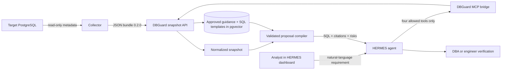
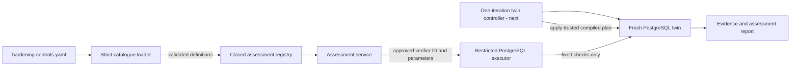

# DBGuardAI

DBGuardAI lets a database analyst describe a PostgreSQL hardening requirement
in ordinary language and receive an evidence-backed SQL proposal for an
engineer to verify. It lowers the knowledge and coding barrier without giving
AI permission to connect to the target database or execute a command.

## Current implemented scope

The runnable POC covers the proposal workflow. The repository now also contains
a strict, tested assessment engine for the reconciliation phase. The public
API/Compose workflow does not yet create a twin or execute a proposal.



## What runs

`deploy/compose.yaml` starts four containers:

- `postgres`: PostgreSQL 16 with pgvector for knowledge and templates;
- `api`: trusted FastAPI boundary for snapshots, retrieval and proposals;
- `mcp`: a read-only HTTP MCP adapter exposing four DBGuard operations;
- `hermes`: the official HERMES Agent v0.21.0 image, pinned by digest, with
  DBGuard instructions, its built-in ChatGPT-style dashboard, authentication,
  and persistent conversation state.

The existing collector stays separate because it runs near the target database
and sends its output to DBGuardAI. The twin runner and reporting source remain
in the repository for later phases but are not enabled in Compose.

## Quick start

1. Copy `.env.example` to `.env` and change all development passwords and API
   keys.
2. Add an Ollama Cloud API key to `OLLAMA_API_KEY`. HERMES defaults to the
   tool-capable `gpt-oss:20b` cloud model through
   `https://ollama.com/v1`; no local chat-model download is required. The
   Ollama free plan includes a starter amount of monthly usage.
3. Start the complete stack:

   ```sh
   docker compose --env-file .env -f deploy/compose.yaml up --build
   ```

4. Open these local pages:

   - HERMES chat: `http://localhost:9119`
   - DBGuard API documentation: `http://localhost:8000/docs`

5. Sign in to HERMES with `HERMES_DASHBOARD_USERNAME` and
   `HERMES_DASHBOARD_PASSWORD` from `.env`.
6. Upload the collector JSON to `POST /api/v1/snapshots`, then give the
   returned `snapshot_id` to the chat and describe the hardening requirement.

HERMES and both host-facing ports bind to localhost. The dashboard password is
hashed into the runtime configuration at container startup; plaintext is not
baked into the image.

The chat model and RAG embedding model are separate. Ollama Cloud currently
accepts `gpt-oss:20b` chat requests but does not provide the configured
`nomic-embed-text` embedding model. Existing document vectors remain stored,
but ingesting or semantically querying content requires either a local
`nomic-embed-text` service or a separately configured cloud embedding
provider. Never send unredacted database secrets to either provider.

## What the chat can do

HERMES receives the `dbguard-hardening` skill on every dashboard session. Its
MCP allowlist contains only:

| HERMES operation | What it does |
|---|---|
| `get_snapshot_context` | Reads normalized, redacted facts from one uploaded collector snapshot |
| `search_approved_knowledge` | Finds only active, effective and applicable PostgreSQL guidance |
| `search_approved_templates` | Finds only active, human-reviewed SQL templates |
| `compile_hardening_proposal` | Revalidates the selection and renders a review-only SQL proposal |

HERMES cannot use this bridge to ingest or approve content, access PostgreSQL,
execute SQL, use the host shell, or operate Docker.

## API endpoints

| Method | Endpoint | Simple purpose |
|---|---|---|
| `GET` | `/api/v1/health` | Check whether the DBGuard API is ready |
| `POST` | `/api/v1/snapshots` | Validate and store collector bundle `0.2.0` |
| `GET` | `/api/v1/snapshots/{snapshot_id}` | Read safe normalized snapshot context |
| `POST` | `/api/v1/knowledge/documents` | Ingest a draft or explicitly reviewed source |
| `POST` | `/api/v1/knowledge/documents/{id}/approve` | Record human approval of a draft source |
| `GET` | `/api/v1/knowledge/documents/{id}` | Inspect source provenance and lifecycle |
| `GET` | `/api/v1/knowledge/search` | Search only approved, applicable guidance |
| `POST` | `/api/v1/templates/ingest` | Ingest one draft or reviewed SQL template |
| `POST` | `/api/v1/templates/ingest-all` | Ingest bundled SQL templates |
| `GET` | `/api/v1/templates/search` | Search approved templates by semantic similarity |
| `POST` | `/api/v1/templates/{name}/approve` | Record human approval of an exact template version |
| `POST` | `/api/v1/proposals/compile` | Validate HERMES's choices and deterministically render approved templates from PostgreSQL |

The HERMES workflow uses `/api/v1/proposals/compile` so there is only one
reasoning agent. The trusted backend still reruns retrieval, rejects template
IDs outside the active result set, applies safe parameter handling, and
requires approved RAG evidence before returning SQL.

The older `metadata_snapshot` field remains on `/api/v1/proposals/compile` for client
compatibility, but new integrations should always use `snapshot_id`.

## Evidence and approval rules

- `[]` means the collector checked a section and found no records.
- `null` plus a matching `gaps` entry means it could not collect that section.
- Knowledge is searchable only while its parent document is active, effective,
  unexpired, and applicable to the requested PostgreSQL version/environment.
- Knowledge and SQL templates default to draft and require named human
  approval before retrieval.
- Re-ingesting changed knowledge atomically replaces its chunks and returns the
  document to review where required.
- Every generated command remains a proposal. A qualified engineer must verify
  it before it is applied.

## Assessment and reconciliation foundation

The first reconciliation implementation is present in `services/assessment/`.
It converts reviewed catalogue data into deterministic checks without allowing
HERMES or the LLM to provide assessment SQL, verifier names, expected results,
or pass/fail decisions.



### Real and simulated executors

`PostgresAssessmentExecutor` is the real implementation intended for the
application. It connects only to a disposable PostgreSQL twin and performs the
16 allowlisted metadata and behavioural checks. It cannot execute SQL supplied
by HERMES or an LLM.

`FakeExecutor` exists only inside `tests/test_assessment_foundations.py`. It is
a test double that returns pre-programmed observations so the catalogue,
evidence validation, error handling and report aggregation can be tested
quickly without Docker. It is never imported or selected by the runtime. Both
are kept: fast unit tests use the test double, while PostgreSQL integration
tests use the real executor.

### Assessment files

| File | What it does |
|---|---|
| `catalog/controls/hardening-controls.yaml` | Machine-readable source catalogue, provider policy, template assessments, evidence requirements and remediation mappings |
| `catalog/controls/README.md` | Explains the current catalogue lifecycle and which assessment parts remain unavailable |
| `services/assessment/catalog_loader.py` | Parses YAML safely and rejects unknown fields, duplicate keys or IDs, unapproved sources, version mismatches, unknown parameter models and unknown verifier IDs |
| `services/assessment/definition.py` | Defines a validated template-assessment definition and the shared PostgreSQL identifier rules |
| `services/assessment/models.py` | Defines criteria, observations, evidence references, results, reports and readiness/status values |
| `services/assessment/registry.py` | Loads the YAML once and exposes only exact registered template name/version pairs |
| `services/assessment/service.py` | Runs registered criteria through a restricted executor boundary, verifies evidence and calculates suite/overall statuses |
| `services/assessment/fixtures.py` | Creates synthetic tables before/after hardening and manages the role's twin-only test credential |
| `services/assessment/postgres_executor.py` | Implements all 16 fixed PostgreSQL metadata and behavioural checks without an arbitrary-SQL interface |
| `services/assessment/evidence.py` | Captures hashed, redacted query/command evidence behind a replaceable storage boundary |
| `services/assessment/verifiers/read_only_role.py` | Defines the permitted parameters and 13 allowlisted check names for the read-only-role template |
| `services/assessment/verifiers/revoke_public_access.py` | Defines the permitted parameters and three allowlisted check names for the PUBLIC-access revocation template |
| `tests/test_assessment_foundations.py` | Uses a test-only simulated executor to test loading, fail-closed rejection, evidence handling, remediation mapping and status aggregation without a database |
| `tests/test_postgres_assessment_executor.py` | Checks the closed executor boundary and, when a dedicated test DSN is supplied, runs both template assessments against real PostgreSQL |

The two current template definitions provide 16 checks in total. These checks
cover the requested read-only behaviour and limited related safety properties,
but they are not the complete CIS PostgreSQL benchmark.

`baseline_profiles` and `baseline_controls` are intentionally empty until the
converted CIS content has been reviewed and mapped to exact source versions,
control IDs, applicability, assessment providers and evidence requirements.
Consequently, the global baseline state is `NOT_READY`. Template-specific
checks may pass, but DBGuard reports the overall result as `UNKNOWN` rather
than incorrectly treating an empty baseline as compliance.

Approving a knowledge document through the API makes it available to RAG for
explanation and retrieval. It does not authorize that document to create or
execute controls. Control-authoring approval is a separate catalogue review.

## Repository structure

```text
backend/                       Trusted FastAPI application
collector/                     Existing read-only PostgreSQL evidence collector
db/                            Canonical PostgreSQL + pgvector schema
deploy/                        Four-service Docker Compose stack
hermes/                        Official-image wrapper, config, context and skill
services/dbguard_mcp/          Restricted HTTP MCP-to-API adapter
services/rag/                  Lifecycle-aware knowledge ingestion and retrieval
services/assessment/           Strict catalogue and deterministic check foundation
services/twin_runner/          Deferred twin lifecycle library
services/reporting/            Deferred reporting library
catalog/controls/              Assessment catalogue and future CIS baseline controls
catalog/images/examples/       Non-runnable image-record examples
```

See [ARCHITECTURE.md](ARCHITECTURE.md) for the detailed trust boundaries,
endpoint behavior and application flow. See [hermes/README.md](hermes/README.md)
for HERMES packaging, installation and troubleshooting.

## Deferred work

- reviewed CIS baseline profiles and structured control mappings;
- CIS-CAT execution and result mapping against the twin;
- maximum-three-iteration reconciliation controller;
- twin-runner HTTP boundary and verified PostgreSQL image catalog;
- proposal review-package reporting and approval workflow;
- production identity, authorization, audit logging and secret management;
- production network isolation and deployment hardening.
