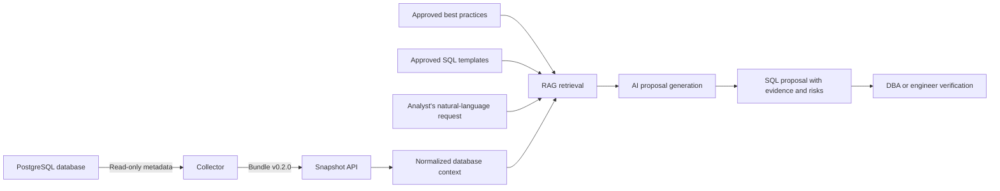

# DBGuardAI

DBGuardAI turns a natural-language PostgreSQL hardening requirement into an
evidence-backed SQL proposal that a DBA or engineer can verify. This lowers the
knowledge barrier for junior database analysts without removing human control.

## Current implemented scope

The current POC covers the proposal workflow only:



Assessment is intentionally deferred. Twin-runner and reporting source are
retained for later phases but are not part of the runnable stack.

See [ARCHITECTURE.md](ARCHITECTURE.md) for the complete component explanation,
endpoint guide, data relationships, lifecycle rules, and workflow diagrams.

## What is runnable

- `collector/`: the existing read-only PostgreSQL collector, owned by the
  collector workstream and unchanged by this consolidation.
- `backend/`: the single FastAPI boundary for snapshots, knowledge retrieval,
  templates, and proposal generation.
- `services/rag/`: document ingestion, chunking, lifecycle-aware retrieval, and
  citations, used inside the API process.
- `db/init.sql`: the only database schema for pgvector knowledge and templates.
- `hermes/`: proposal instructions, typed output, and MCP restrictions packaged
  for an externally supplied HERMES runtime.

## API endpoints

| Method | Endpoint | Purpose |
|---|---|---|
| `GET` | `/api/v1/health` | Current service and enabled-phase status |
| `POST` | `/api/v1/snapshots` | Validate and store collector schema `0.2.0` |
| `GET` | `/api/v1/snapshots/{snapshot_id}` | Read normalized proposal context |
| `POST` | `/api/v1/knowledge/documents` | Ingest a draft or reviewed source document |
| `POST` | `/api/v1/knowledge/documents/{id}/approve` | Activate a human-reviewed draft |
| `GET` | `/api/v1/knowledge/documents/{id}` | Inspect lifecycle and provenance |
| `GET` | `/api/v1/knowledge/search` | Search active and applicable guidance |
| `POST` | `/api/v1/templates/ingest` | Ingest a draft or reviewed SQL template |
| `POST` | `/api/v1/templates/ingest-all` | Ingest bundled SQL templates |
| `POST` | `/api/v1/templates/{template_name}/approve` | Activate a human-reviewed template |
| `GET` | `/api/v1/templates/search` | Search reviewed SQL templates |
| `POST` | `/api/v1/harden` | Generate a review-only proposal |

The hardening endpoint accepts `snapshot_id`. The older `metadata_snapshot`
field remains temporarily for client compatibility but should not be used for
new collector integrations.

## Quick start

1. Copy `.env.example` to `.env` and set a local database password plus either
   OpenAI or Ollama model configuration.
2. Start the API and pgvector database:

   ```sh
   docker compose --env-file .env -f deploy/compose.yaml up --build
   ```

3. Open `http://localhost:8000/docs` for the generated API interface.
4. Upload the JSON emitted by `collector/dbguard-collect.sh` to
   `POST /api/v1/snapshots`.
5. Ingest approved guidance and SQL templates, then call `POST /api/v1/harden`
   with the returned `snapshot_id` and a natural-language requirement.

## Evidence rules

- A collector value of `[]` means the section was collected and no records
  existed.
- `null` plus a matching `gaps` item means the section could not be collected.
  DBGuard preserves this distinction and exposes the gap to the proposal agent.
- Knowledge search returns only documents that are active, already effective,
  not expired, and applicable to the requested PostgreSQL version/environment.
- New knowledge is a draft by default and becomes searchable only after a human
  records approval through the approval endpoint.
- New SQL templates are also drafts by default. This is the engineer checkpoint:
  verify the command and parameters, then approve it for agent retrieval.
- Re-ingesting a document atomically replaces its previous chunks, preventing
  stale duplicate search results.
- Generated SQL is always a proposal. A qualified engineer must verify it before
  applying it to any database.

## Repository structure

```text
backend/                 FastAPI app and container image
collector/               Read-only PostgreSQL evidence collector
db/                      Canonical pgvector schema
deploy/                  Current API + database Compose stack
hermes/                  Proposal agent package and restrictions
services/rag/             Knowledge ingestion and retrieval library
services/twin_runner/     Deferred twin lifecycle library
services/reporting/       Deferred assessment reporting library
catalog/controls/         Future reviewed control definitions
catalog/images/examples/  Non-runnable image-record examples
```

## Security boundary

HERMES can read stored snapshot context, search approved evidence and templates,
and create a proposal. It cannot connect to PostgreSQL, run SQL, use a shell or
Docker, change knowledge lifecycle, approve its own proposal, or claim execution
success.

## Deferred work

- baseline assessment/scoring;
- HERMES runtime wiring to the API tool endpoints;
- authenticated multi-user access;
- twin-runner API, verified image catalog, and integration tests;
- proposal review-package reporting and approval workflow;
- production secret management and operational hardening.
